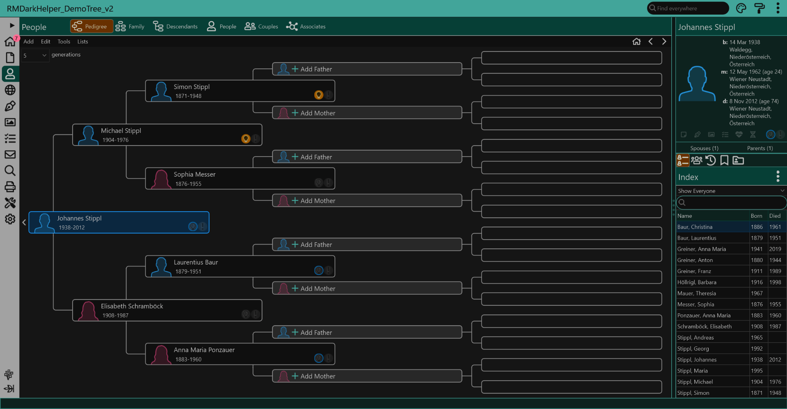
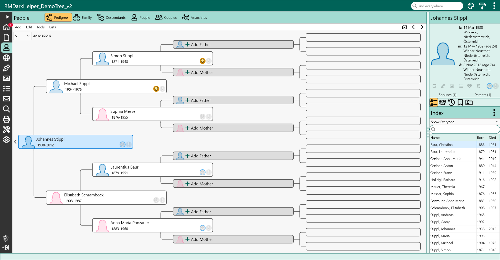
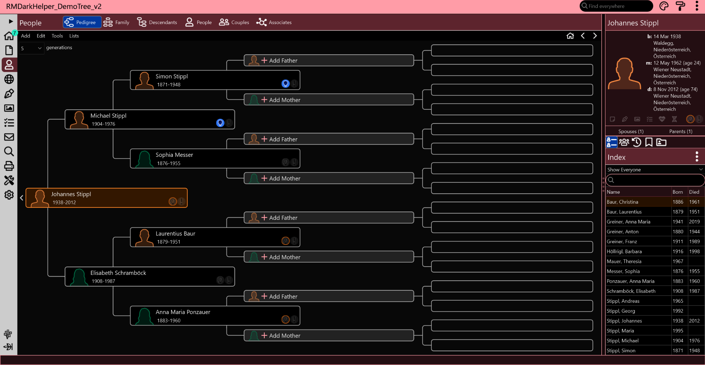
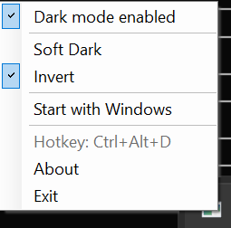

# RM Dark Helper

[](https://github.com/christine-fritz/rm-dark-helper/actions/workflows/build.yml)
[](LICENSE)

A lightweight, unofficial dark-mode overlay for RootsMagic 11 on Windows.

> **Independent project.** RM Dark Helper is not affiliated with or endorsed by RootsMagic, Inc. RootsMagic is a trademark of RootsMagic, Inc.

## Screenshots

### Soft Dark



### Original / Soft Dark / Invert

| Original | Soft Dark | Invert |
|---|---|---|
|  |  |  |

### Tray controls



## Features

- darkens the main RootsMagic window
- handles separate top-level windows such as **Edit Person**
- **Soft Dark** mode with better hue preservation
- **Invert** mode
- global `Ctrl + Alt + D` toggle
- stays dark while another application has focus
- optional **Start with Windows** setting in the tray menu
- single-instance protection
- portable: no installer required

## Privacy and security

RM Dark Helper is intentionally small and auditable. It does **not**:

- read or modify `.rmtree` databases
- read or modify GEDCOM files
- inject code into RootsMagic
- access genealogy data
- access the network
- install a Windows service
- require administrator rights for normal use

Release binaries are built from the public source by GitHub Actions and are accompanied by SHA-256 checksums.

See the [privacy policy](PRIVACY.md), [security policy](SECURITY.md), and [Code signing policy](CODE_SIGNING.md).

**Code signing policy:** Free code signing provided by SignPath.io, certificate by SignPath Foundation.

> Windows SmartScreen can warn about a new unsigned executable even when the source and build are clean. Code signing is planned for public releases.

## Download

The latest public release is available from the [GitHub Releases page](https://github.com/christine-fritz/rm-dark-helper/releases/latest).

Free code signing is provided by SignPath.io, certificate by SignPath Foundation, subject to acceptance into the SignPath Foundation Open Source program. Until that integration is complete, the currently published v1.0.0 binary remains unsigned.

## Requirements

- Windows 10 or Windows 11, x64
- RootsMagic 11

## Installation

RM Dark Helper is portable. A convenient location is:

```text
C:\Apps\RMDarkHelper\RMDarkHelper.exe
```

Start the executable, then right-click its tray icon to configure it.

To launch it automatically after signing in to Windows, enable:

```text
Start with Windows
```

This creates a shortcut named `RM Dark Helper.lnk` in the current user's Startup folder. Disabling the option removes the shortcut again. No registry entry is used.

## Uninstallation

RM Dark Helper is portable. To remove it:

1. If **Start with Windows** is enabled, disable it first from the tray menu.
2. Exit RM Dark Helper.
3. Delete `RMDarkHelper.exe` from the folder where you placed it.

No uninstaller or registry cleanup is required.

## Usage

The tray menu provides:

```text
Dark mode enabled
Soft Dark
Invert
Start with Windows
About
Exit
```

Use `Ctrl + Alt + D` to quickly toggle the filter.

## How it works

RM Dark Helper identifies the `RootsMagic.exe` process and applies a visual transformation to its visible top-level windows through the Windows Magnification API. Each RootsMagic window receives a click-through, non-activating overlay that follows the underlying window.

The application does not patch RootsMagic itself.

## Build from source

1. Clone or download this repository.
2. Run `BUILD.cmd` on Windows.
3. `RMDarkHelper.exe` is created in the repository root.

The build uses the Microsoft .NET Framework compiler:

```text
C:\Windows\Microsoft.NET\Framework64\v4.0.30319\csc.exe
```

Source files are in [`src/`](src/).

GitHub Actions performs the same Windows build and generates `SHA256SUMS.txt` for the resulting executable.

## Known limitation

The visual filter is based on a Windows color matrix. **Soft Dark** preserves hues better than a plain RGB inversion, but pictures and colors can still change in brightness.

## Reporting problems

Please open a GitHub issue and include:

- Windows version
- RootsMagic version
- what you expected to happen
- what actually happened
- whether the problem occurs in the main window or a separate dialog

For security issues, see [SECURITY.md](SECURITY.md).

## License

MIT — see [LICENSE](LICENSE).
